# Datadog Observability Platform

### End-to-end application observability using Flask, DogStatsD, Datadog APM, centralised log management, SLO engineering, burn-rate alerting, and incident response

---

## Overview

The **Datadog Observability Platform** is a production-style observability and reliability engineering project built around a Flask-based reliability test service. It demonstrates how modern engineering teams monitor application health, measure service reliability, investigate incidents, and analyse performance using Datadog.

Rather than focusing only on infrastructure monitoring, this project implements the **complete observability lifecycle** by combining all three pillars — **Metrics**, **Logs**, and **Traces** — with reliability engineering practices including **SLOs**, **Error Budgets**, **Burn Rate Alerting**, **APM**, **Chaos Engineering**, and **Incident Response**.

A custom Flask application and traffic generator simulate production traffic while configurable chaos scenarios intentionally introduce failures and latency, allowing the entire monitoring and incident response pipeline to be validated under controlled conditions.

---

## Dashboard


---

## Architecture

```
                        Traffic Generator
                 Weighted continuous request simulation
              /service 75%  /slow 15%  /error 5%  /health 5%
                               │
                               ▼
                  Flask Reliability Test Service
                               │
           ┌───────────────────┼───────────────────┐
           ▼                   ▼                   ▼
        Metrics              Logs               Traces
      (DogStatsD)        (Structured)         (ddtrace)
      UDP :8125          logs/app.log         TCP :8126
           │                   │                   │
           └───────────────────┼───────────────────┘
                               ▼
                         Datadog Agent
                  DogStatsD · Log Pipeline · APM
                         Grok Parser
                               │  HTTPS
                               ▼
                      Datadog Platform
                               │
         ┌──────────┬──────────┼──────────┬──────────┐
         ▼          ▼          ▼          ▼          ▼
     Metrics      Logs        APM        SLOs    Monitors
     Explorer   Explorer   Traces &   Availability  Burn Rate
                           Flame Graphs  Latency   P1/P2/P3
                               │
                               ▼
                     Operational Dashboard
                               │
                               ▼
                    Incident Investigation
                               │
                               ▼
                 RCA  ·  Runbooks  ·  Postmortem
```

Every incoming request simultaneously produces a **metric**, a **log line**, and a **trace** — all sharing the same `dd.trace_id`, linking the three signals permanently for correlated investigation.

---

## What was built

### Phase 1 — Service and metrics collection
Flask reliability test service with five API endpoints, a runtime chaos injection engine, pre-baked failure scenarios, and a weighted traffic generator. Custom metrics emitted to Datadog via DogStatsD with `endpoint`, `status`, and `status_class` tags for granular per-endpoint filtering.

### Phase 2 — Reliability engineering
Defined two Service Level Indicators and implemented two Service Level Objectives in Datadog. Availability SLO (99.5% over 30 days) and Latency SLO (95% of requests under 300ms over 7 days). Error budgets automatically calculated and tracked by Datadog — 3.6 hours of allowable downtime per month for the availability target.

### Phase 3 — Burn-rate alerting
Replaced noisy threshold-based monitors with a dual-window burn-rate alerting strategy. Implemented P1 fast burn (14x/1h and 5x/6h), P2 medium burn (1.5x/6h), and P3 informational monitors with configured severity routing. Documented the before/after comparison in `docs/alert_noise_comparison.md`.

### Phase 4 — Operational dashboard
Unified Datadog dashboard covering SLO status, error budget remaining, burn rate over time, request traffic split, success vs failure counts, response time by endpoint (p50/p95/p99), active alert feed, and event stream.

### Phase 5 — Incident response
Simulated a production incident using the chaos engine. Produced a complete incident response pack: P1 runbook, P2 runbook, incident timeline, root cause analysis, contributing factors, action items, and a full postmortem document.

### Phase 6 — Centralised log management
Configured Datadog Agent log collection from `logs/app.log`. Built a custom log processing pipeline with a Grok parser extracting `endpoint`, `status_code`, `latency_ms`, and `is_error` as searchable facets in Datadog Log Explorer.

### Phase 7 — APM and distributed tracing
Instrumented Flask with Datadog APM using `ddtrace`. Every request automatically generates a trace. `span.error = 1` marks 500 responses red in APM. `dd.trace_id` injected into all log lines enables direct log-to-trace correlation — completing full three-pillar observability.

---

## API endpoints

| Endpoint | Purpose | Chaos |
|---|---|---|
| `GET /health` | Uptime check — always returns 200 | Never |
| `GET /service` | Primary traffic (75% of load) | Yes |
| `GET /slow` | Latency simulation — 2s fixed base delay | Yes (additive) |
| `GET /error` | Fixed 30% failure — models flaky dependency | No (independent) |
| `GET /chaos` | Returns current chaos configuration | — |
| `POST /chaos` | Manual chaos injection | — |
| `POST /reset` | Clears all chaos config instantly | — |
| `GET /scenarios` | Lists available pre-baked scenarios | — |
| `POST /scenarios/<name>` | Applies a named scenario | — |

### Pre-baked chaos scenarios

| Scenario | Error rate | Latency | Alert triggered |
|---|---|---|---|
| `fast_burn` | 50% | 0ms | P1 — budget exhausted rapidly |
| `slow_burn` | 5% | 0ms | P2 — threshold monitors miss this |
| `latency_spike` | 0% | 800ms | P3 informational |
| `combined` | 20% | 500ms | Realistic degradation |

---

## Metrics

| Metric | Type | Description |
|---|---|---|
| `service.request.count` | Counter | Every request regardless of outcome |
| `service.success.count` | Counter | Requests returning 2xx |
| `service.failure.count` | Counter | Requests returning 5xx |
| `service.response_time_ms` | Gauge | Latency per request in milliseconds |
| `service.error_rate` | Gauge | Binary 0/1 — consumed directly by SLO monitors |
| `service.latency.good.count` | Counter | Requests on /service completing under 300ms |

All metrics tagged with `endpoint:<name>`, `status:<code>`, `status_class:<2xx|5xx>`.

---

## SLOs and error budgets

| SLO | Target | Window | Error budget |
|---|---|---|---|
| Availability | 99.5% | 30 days | 3.6 hours/month |
| Latency | 95% under 300ms | 7 days | 5% of requests may exceed 300ms |

---

## Burn-rate monitors

| Monitor | Multiplier | Window | Severity | Routing |
|---|---|---|---|---|
| Fast burn | 14x | 1 hour | P1 | Page immediately |
| Fast burn | 5x | 6 hours | P1 | Page immediately (dual window) |
| Medium burn | 1.5x | 6 hours | P2 | Create ticket |
| Slow burn | — | — | P3 | Log only |

---

## Key engineering decisions

### Burn-rate alerting over threshold alerting

Threshold monitors fire when a metric crosses a fixed line — they generate false positives on brief spikes and miss slow burns entirely. A threshold monitor set at 1% error rate stays silent when error rate drifts to 0.8% for six hours, consuming 80% of the daily error budget without triggering a single alert.

Burn-rate monitors measure how fast the error budget is being consumed relative to the SLO window. A 14x burn rate over 1 hour means the monthly budget will be exhausted in ~2 days. A 1.5x burn rate over 6 hours catches gradual degradation that no threshold monitor would detect. The before/after comparison is documented in `docs/alert_noise_comparison.md`.

### Custom chaos API over a public third-party API

Using a public API creates an uncontrollable dependency — you cannot inject failures, control latency, or reproduce specific scenarios reliably. The custom `/chaos` endpoint and pre-baked `/scenarios` allow configurable failure injection at runtime without touching application code. This enables controlled testing of every alert tier and produces reproducible incident scenarios for the postmortem documentation.

### 99.5% availability SLO rather than 99.9%

A 99.9% SLO allows only 43.8 minutes of downtime per month — too tight for a simulated service to produce meaningful burn-rate demonstration scenarios within a reasonable window. 99.5% gives a 3.6-hour budget that drains at observable rates during chaos scenarios, making the alert firing sequence visible and documentable.

### ddtrace over OpenTelemetry

Datadog-native instrumentation provides automatic Flask auto-instrumentation with zero per-endpoint code changes, built-in log-trace correlation via `dd.trace_id` injection, and `span.error` marking that directly integrates with Datadog's error tracking. OpenTelemetry would add OTel Collector infrastructure and OTLP exporter configuration without meaningful benefit for a single-service Datadog-native project.

### Structured logs with trace ID injection

Plain text logs cannot be parsed into searchable fields efficiently. Key=value structured format (`endpoint=/service status=500 latency_ms=12.00 is_error=1`) allows Datadog to extract fields as facets automatically. Adding `dd.trace_id` to every log line creates a direct link between a log entry and its APM trace — enabling the full metrics → logs → traces investigation workflow from a single log click.

### Dual-window P1 burn-rate monitor

Requiring both the 14x/1h AND 5x/6h conditions to fire simultaneously reduces false positives from short traffic spikes. A 2-minute error burst might trigger the 14x/1h window but would not sustain the 5x/6h window — no P1 fires. A genuine incident sustains elevated error rates across both windows and correctly triggers P1. This is the Google SRE recommended approach.

---

## Three-pillar investigation workflow

```
Alert fires (P1 burn-rate monitor)
        │
        ▼
Dashboard — confirm SLO red, identify which endpoint tag
        │
        ▼
Metrics Explorer — filter service.error_rate by endpoint
        │           confirm spike start time
        ▼
Log Explorer — filter is_error=1, endpoint=service
        │        read error message, copy dd.trace_id
        ▼
APM Traces — paste trace_id, open flame graph
        │     identify failing span and root cause
        ▼
Resolution — POST /reset, confirm recovery in dashboard
        │
        ▼
RCA + Postmortem documentation
```

---

## Screenshots

## Dashboard Overview

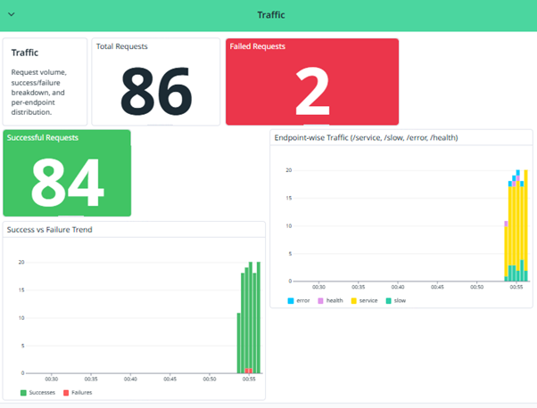

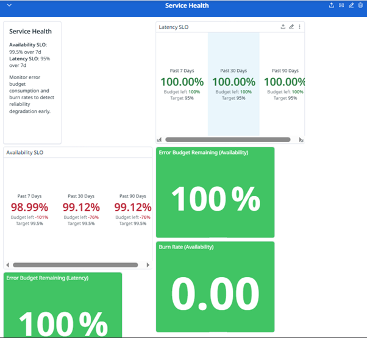

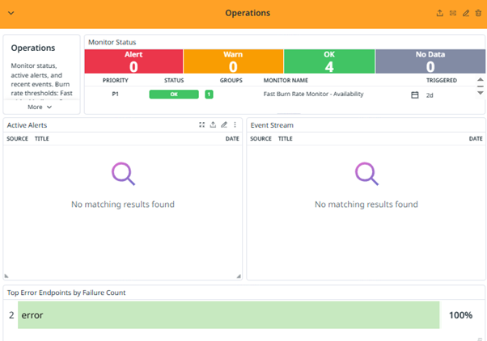

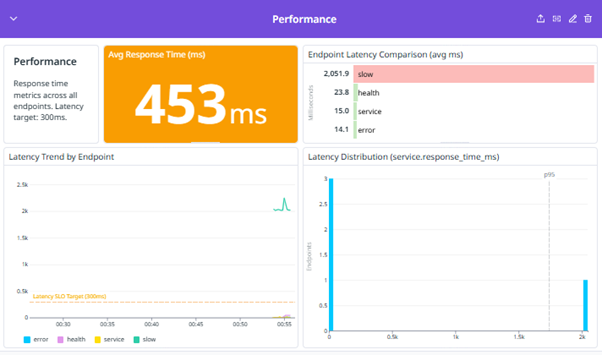

## Service Level Objectives (SLOs)

### Configured SLOs
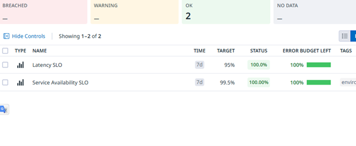

### Service Availability SLO
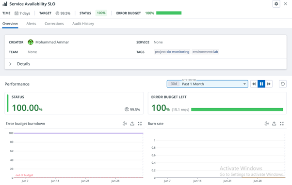

### Service Latency SLO
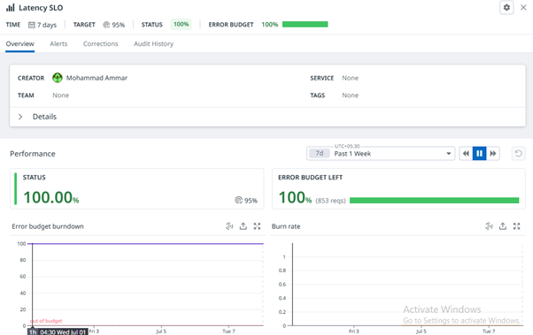

## Custom Metrics

### Successful Service Requests
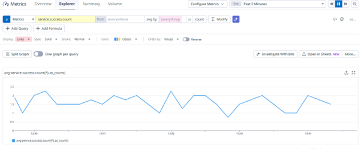

---

## Monitors

### Configured Monitors
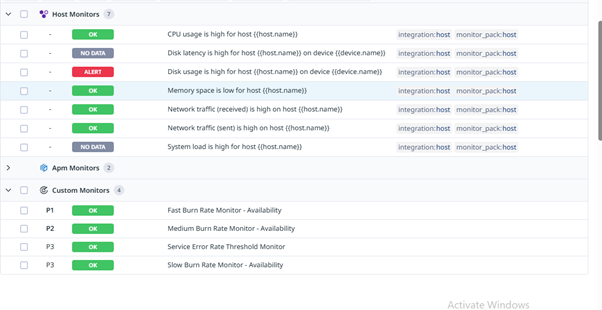

---

## Log Management

### Log Explorer
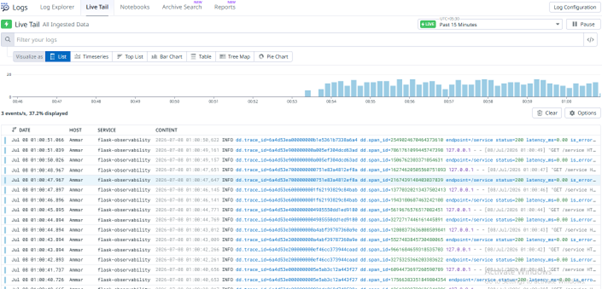

### Log Explorer After Applying Grok Parser
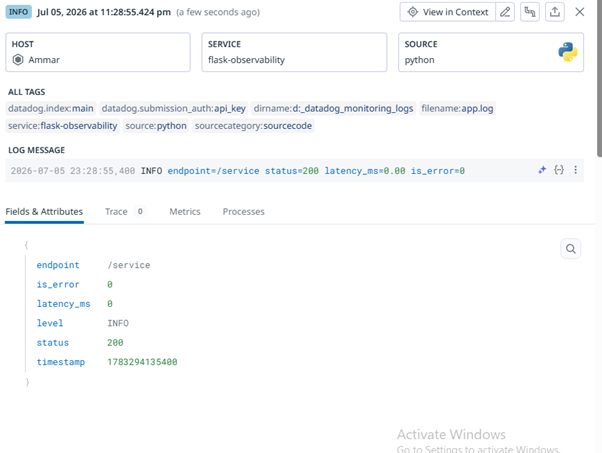

---

## Application Performance Monitoring (APM)

### Service Flow Map
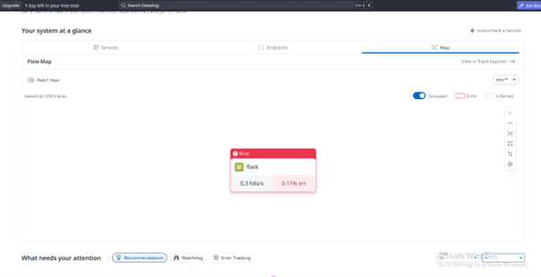

### Instrumented Service Endpoints
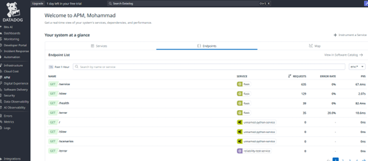

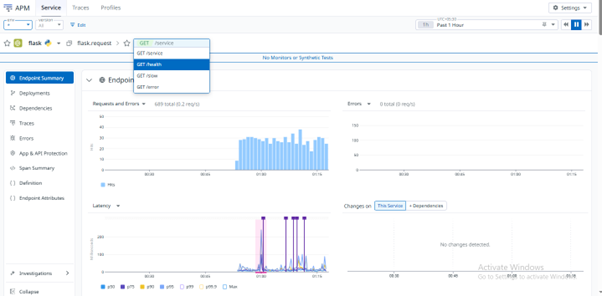

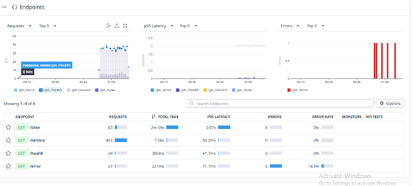

### Flame Graph Analysis

#### Flame Graph 1
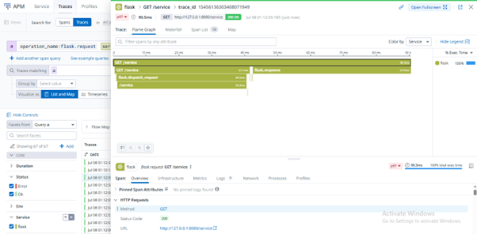

#### Flame Graph 2
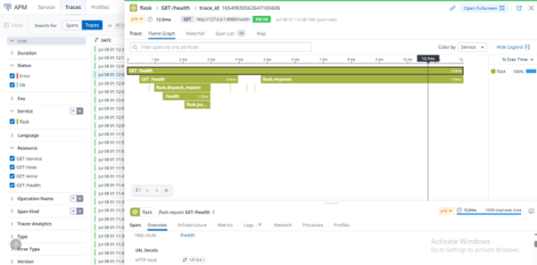

## Repository structure

```
Datadog-Observability-Platform/
│
├── app.py                             # Flask reliability test service
├── traffic_generator.py               # Traffic simulation and metric emitter
├── requirements.txt
├── .gitignore
├── README.md
│
├── docs/
│   ├── slo_definitions.md             # SLI/SLO formulas and rationale
│   ├── alert_noise_comparison.md      # Threshold vs burn-rate before/after
│   ├── dashboard_design.md            # Dashboard layout decisions
│   ├── dashboard_walkthrough.md       # Widget-by-widget walkthrough
│   └── observability_architecture.md  # Full architecture documentation
│
├── incident_response/
│   ├── runbook_p1.md                  # Fast burn P1 response procedure
│   ├── runbook_p2.md                  # Medium burn P2 response procedure
│   ├── postmortem.md                  # Full incident postmortem
│   └── root_cause_analysis.md
│
├── monitor_configs/
│   ├── threshold_monitor.json
│   ├── fast_burn_monitor.json
│   ├── medium_burn_monitor.json
│   └── slow_burn_monitor.json
│
├── conf/
│   ├── datadog_agent_config.yaml      # Agent config (API key redacted)
│   └── log_collection_config.yaml
│
└── screenshots/
    ├── dashboard_overview.png
    ├── slo_compliance.png
    ├── burn_rate_alerts.png
    ├── apm_flow_map.png
    ├── apm_endpoints.png
    ├── apm_flame_graph_slow.png
    ├── apm_error_trace.png
    ├── metrics_explorer.png
    ├── log_explorer.png
    └── grok_parser.png
```

---

## Technology stack

| Layer | Technology |
|---|---|
| Language | Python 3.9+ |
| Web framework | Flask |
| Monitoring platform | Datadog |
| Metrics | DogStatsD (`datadog` SDK) |
| Logging | Datadog Log Management + Grok parser |
| Tracing | Datadog APM (`ddtrace`) |
| Agent | Datadog Agent |
| Documentation | Markdown |

---

## Installation

```bash
# Clone the repository
git clone https://github.com/smammar19/Datadog-Observability-Platform.git
cd Datadog-Observability-Platform

# Create and activate virtual environment
python -m venv venv

# Windows
.\venv\Scripts\Activate.ps1

# macOS / Linux
source venv/bin/activate

# Install dependencies
pip install -r requirements.txt
```

---

## Configuration

Ensure the Datadog Agent is running with the following enabled in `datadog.yaml`:

```yaml
apm_config:
  enabled: true

logs_enabled: true
```

Set environment variables before running:

```powershell
# Windows PowerShell
$env:DD_SERVICE="reliability-test-service"
$env:DD_ENV="dev"
$env:DD_VERSION="1.2"
$env:DD_AGENT_HOST="127.0.0.1"
$env:DD_TRACE_AGENT_PORT="8126"
```

---

## Running the project

Start the Flask service in Terminal 1:

```bash
python app.py
```

Start the traffic generator in Terminal 2:

```bash
python traffic_generator.py
```

Trigger chaos scenarios from Terminal 3:

```bash
# P1 fast burn — 50% error rate
curl -X POST http://127.0.0.1:8080/scenarios/fast_burn

# P2 slow burn — 5% error rate (threshold monitors miss this)
curl -X POST http://127.0.0.1:8080/scenarios/slow_burn

# P3 latency spike — no errors, high latency
curl -X POST http://127.0.0.1:8080/scenarios/latency_spike

# Reset to baseline
curl -X POST http://127.0.0.1:8080/reset

# Check current chaos state
curl http://127.0.0.1:8080/chaos
```

---

## Future improvements

- Docker containerisation
- AWS EC2 deployment with CloudWatch alongside Datadog
- Multi-service distributed tracing
- OpenTelemetry interoperability
- Database monitoring with query-level traces
- Synthetic monitoring
- CI/CD pipeline integration

---

## Documentation

Full documentation is available in `docs/` and `incident_response/` covering architecture design, SLO definitions, alert strategy, dashboard walkthrough, runbooks, RCA, and postmortem.

---

## License

This project is intended for educational and portfolio purposes.

---

## Author

Mohammad Ammar · [LinkedIn](https://www.linkedin.com/in/mohammad-ammar-a9516a171) · [GitHub](https://github.com/smammar19)
